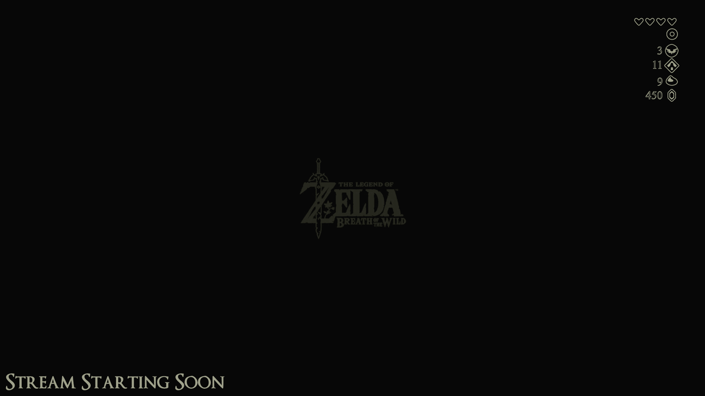
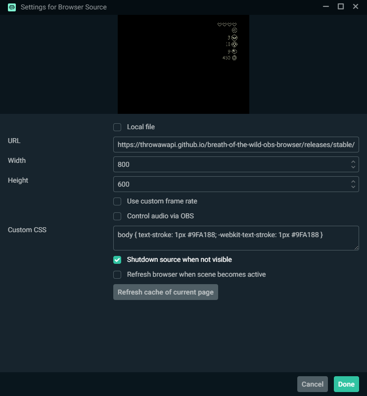
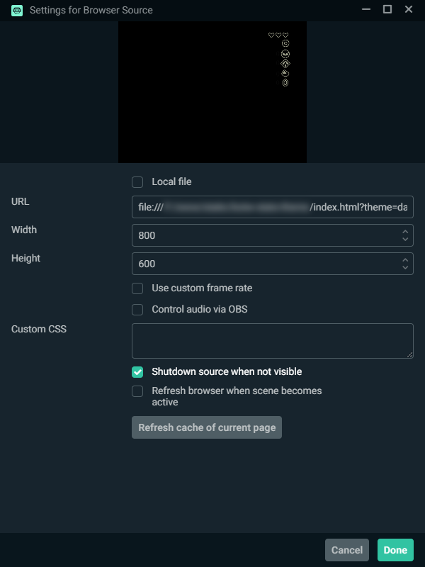

# Breath of the Wild: OBS Browser Source

A simple OBS Browser Source that emulates the information shown on the loading screen of **The Legend of Zelda: Breath of the Wild**. The source is designed to be a *nearly* pixel-perfect recreation at 1080p, but this (obviously) not intended to be relied on. Certainly, your viewers would not notice so long as they are not directly overlaid. If you are not using a 1080p canvas, sit tight. I may eventually add in some configurations options for that. (...or, send me a [pull request](https://github.com/throwawAPI/breath-of-the-wild-obs-browser/pulls))



# Usage

This source uses HTML parameters directly from the URL. These include:
```
?theme=[light|dark]   (default: light)
?hearts=[integer]     (default: 3)
?stamina=[integer]    (default: 5, measured in 1/5ths of a stamina wheel)
?spiritorbs=[integer] (default: 0)
?shrines=[integer]    (default: 0)
?korokseeds=[integer] (default: 0)
?rupees=[integer]     (default: 0)
```

These parameters can be chained in any order. Updating them will cause the OBS Browser Source to update immediently after the field looses focus. While this is the most direct way to calculate these, it does tend to produce extremely long URLs, so... ¯\\\_(ツ)_/¯

# Installation
No installation needed! Just set an OBS Browser Source to [the current stable build, hosted on github](https://throwawapi.github.io/breath-of-the-wild-obs-browser/releases/stable/) (`https://throwawapi.github.io/breath-of-the-wild-obs-browser/releases/stable/`). See the [Usage](#usage) section below for details. Versions are released periodically here as features are added. `/releases/stable/` should always be a live link to the latest version, with no intent to change the underlying API. If this changes, I will note it here. If you are interested in an older release, check the [releases page](https://github.com/throwawAPI/breath-of-the-wild-obs-browser/releases) and follow the link.



If you're still looking to install this OBS Browser Source locally, you can download the source files available on [github](https://github.com/throwawAPI/breath-of-the-wild-obs-browser). Then, you'll want to set your Browser Source URL to `file:///[install directory]/index.html`. Note the triple slash following the `file:` protocol prefix, two of the slashes are associated with the protocol (`file://`) and the final slash is associated with the root directory (`/`). To ensure the correct directory is linked, you can open the `index.html` file in any modern web browser and copy the link from the address bar.


